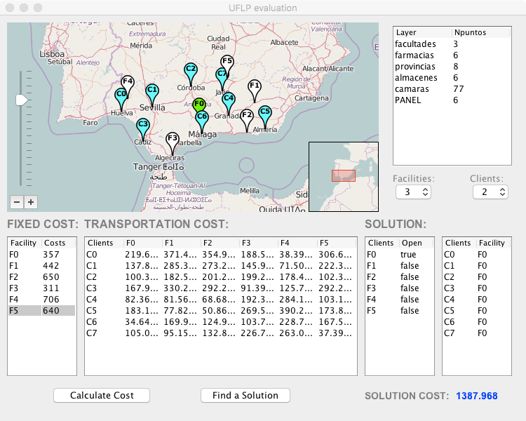
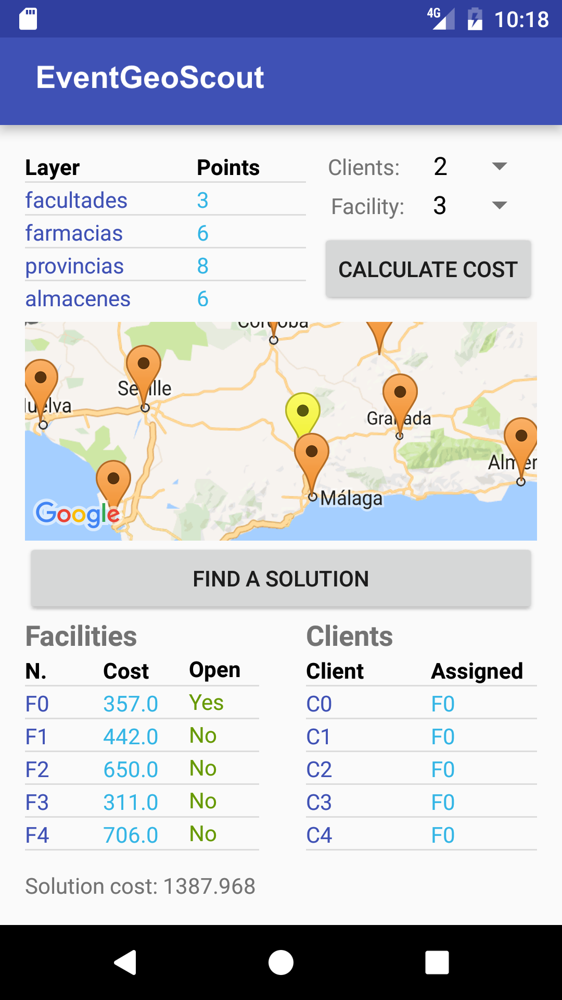

# EventGeoScout: Collaborative Geographic Information Management Framework

## Introduction

This repository introduces EventGeoScout, a groundbreaking collaborative geographic information management framework designed to address the ever-evolving landscape of geographic data integration and quality enhancement. EventGeoScout empowers organizations and users to seamlessly integrate open data from diverse sources, facilitating meticulous data revisions and ensuring data quality.

### Case Study: Uncapacitated Facility Location Problem

To illustrate its adaptability, we provide a case study on the Uncapacitated Facility Location Problem, showcasing the framework's capabilities in solving real-world geographical challenges.

### Screenshot

## Getting Started

For detailed instructions on how to get started with EventGeoScout, please refer to the [documentation](link-to-documentation).

## License

This project is licensed under the [License Name](link-to-license) - see the [LICENSE](LICENSE) file for details.

## Acknowledgments

We would like to express our gratitude to the open-source community and contributors who have helped shape and develop EventGeoScout into what it is today.

